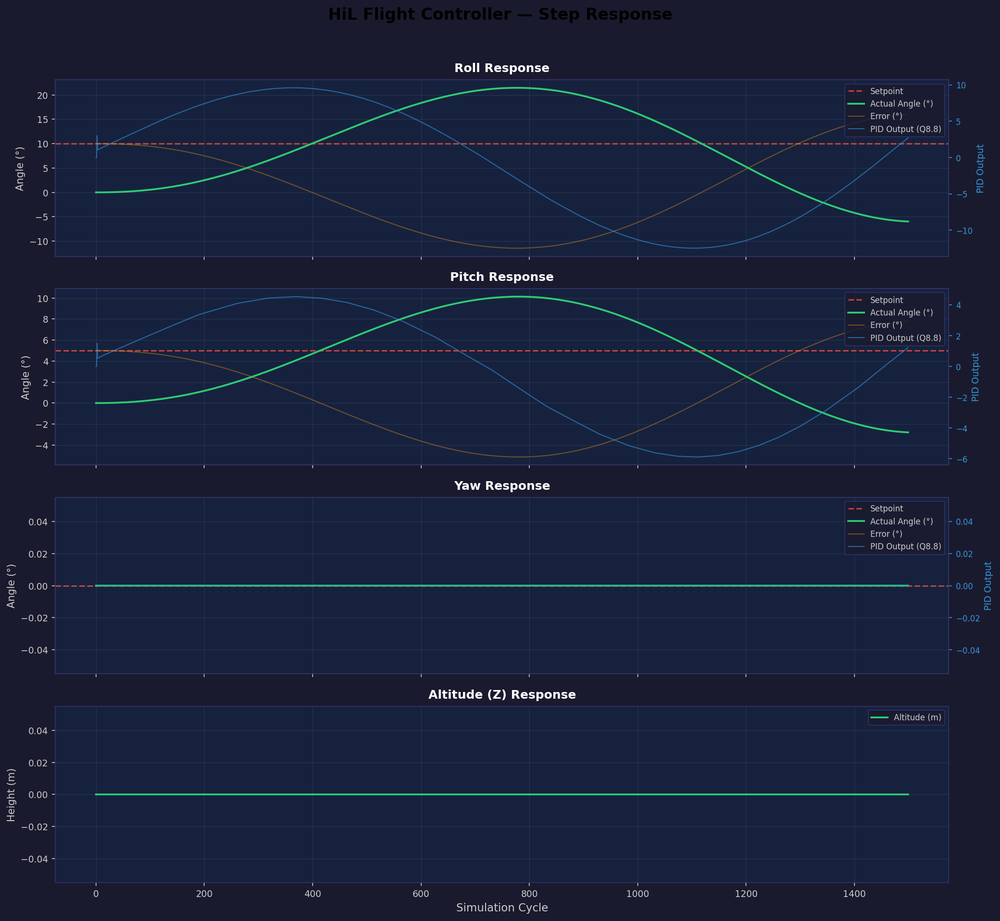

# HiL Quadcopter Flight Controller Core

A complete simulation-ready **Verilog** flight controller for a quadcopter, featuring hardware PID control with **signed Q8.8 fixed-point arithmetic** and a Python **Hardware-in-the-Loop (HiL)** testbench using [cocotb](https://www.cocotb.org/).

---

## Key Features

- **Runtime-Writable Gain Registers:** PID gains are configurable on-the-fly via a memory-mapped `gain_regs` module, enabling runtime tuning without recompilation.
- **6-DOF Physics Simulation:** The HiL testbench models both rotational dynamics and translational physics (Newton's second law, altitude/thrust).
- **Robust Arithmetic & Overflow Detection:** Signed Q8.8 fixed-point math with dedicated 32-bit intermediate overflow flags for the PIDs and saturation modules.
- **Active Cocotb Assertions:** The testbench actively verifies correctness with settle-time checks, integrator anti-windup verification, and duty-cycle range assertions.
- **Clock-Agnostic PWM:** `pwm_gen.v` automatically calculates period counters at elaboration time based on parameterized `CLK_FREQ` and `PWM_FREQ`.
- **Automated CI Pipeline:** GitHub Actions workflow compiles the RTL and runs tests with Icarus Verilog on every push.
- **Strict Motor Mixing Clamps:** The X-frame mixer implements independent clamping for per-motor outputs to enforce a strict physical maximum of 100% duty cycle.

---

## Architecture

```
  Error Inputs (Q8.8)           Motor Outputs
  ┌──────────────┐              ┌───────────┐
  │ roll_error   │──►[PID]──►[SAT]──┐       │
  │ pitch_error  │──►[PID]──►[SAT]──┤►[MIX]─┤──► motor0_duty ──►[PWM]──► pwm_out0
  │ yaw_error    │──►[PID]──►[SAT]──┤       │──► motor1_duty ──►[PWM]──► pwm_out1
  │ throttle     │──────────────────┘       │──► motor2_duty ──►[PWM]──► pwm_out2
  └──────────────┘                          │──► motor3_duty ──►[PWM]──► pwm_out3
                                            └───────────┘
```

Three independent **PID controllers** (roll, pitch, yaw) process error signals, pass through **saturation guards** for anti-windup protection, feed into an **X-frame mixer** that computes four motor duties, which are then converted to **50 Hz PWM** signals.

PID gains (Kp/Ki/Kd × 3 axes) are stored in a **runtime-writable register file** (`gain_regs`) accessible via a simple parallel bus — no recompilation needed to retune. This enables live tuning from the Python HiL testbench and opens the door to auto-tuning.

The HiL testbench closes the loop with a **Python 6-DOF physics model** (including both rotational and translational dynamics) — reading motor outputs, simulating quadcopter physics, and writing errors back into the DUT each clock cycle.

---

## Fixed-Point Format: Signed Q8.8

All arithmetic in the Verilog design uses **signed Q8.8** — a 16-bit two's complement format:

| Bit 15 (sign) | Bits 14:8 (integer) | Bits 7:0 (fraction) |
|:-:|:-:|:-:|
| 1 bit | 7 bits | 8 bits |

- **Range:** −128.0 to +127.996
- **Resolution:** 1/256 ≈ 0.0039
- **No floating point** anywhere in Verilog

**Conversion:**
```python
# Python ↔ Q8.8
def float_to_q88(val):
    return int(round(val * 256)) & 0xFFFF

def q88_to_float(val):
    if val >= 0x8000: val -= 0x10000
    return val / 256.0
```

---

## Repository Structure

```
hil-flight-controller/
├── rtl/
│   ├── gain_regs.v                # Runtime-writable PID gain register file
│   ├── pid_controller.v           # PID with runtime gain inputs (Q8.8)
│   ├── saturation_guard.v         # Combinational clamping + anti-windup
│   ├── mixer.v                    # X-frame motor mixing matrix
│   ├── pwm_gen.v                  # Counter-based 50 Hz PWM generator
│   └── flight_controller_top.v    # Top-level integration + gain bus
├── sim/
│   ├── tb_pid.v                   # Standalone Verilog PID testbench
│   ├── tb_flight_controller.py    # Cocotb HiL testbench with physics
│   ├── plot_response.py           # Matplotlib step response plotter
│   └── Makefile                   # Cocotb simulation Makefile
├── docs/
│   └── architecture.md            # Detailed module documentation
└── README.md
```

---

## Running the Simulation

### Prerequisites

| Tool | Version | Install |
|:-----|:--------|:--------|
| [Icarus Verilog](http://iverilog.icarus.com/) | ≥ 11.0 | `apt install iverilog` / [download](http://iverilog.icarus.com/) |
| [Python](https://python.org) | ≥ 3.8 | — |
| [cocotb](https://www.cocotb.org/) | ≥ 1.8 | `pip install cocotb` |
| [matplotlib](https://matplotlib.org/) | ≥ 3.5 | `pip install matplotlib numpy` |

### Step 1: Standalone PID Verification

Verify the PID controller and saturation guard in isolation:

```bash
# Compile
iverilog -o sim/tb_pid rtl/pid_controller.v rtl/saturation_guard.v sim/tb_pid.v

# Run
vvp sim/tb_pid

# View waveforms (optional, requires GTKWave)
gtkwave tb_pid.vcd
```

Expected output: PID responds to step errors, integral accumulates, saturation clamps at limits, runtime gain change takes effect immediately, reset zeroes all state.

### Step 2: Full HiL Simulation (cocotb)

Run the closed-loop Hardware-in-the-Loop simulation:

```bash
python sim/run_sim.py
```

This will:
1. Compile all Verilog RTL with Icarus Verilog
2. Run the cocotb testbench with the embedded physics model
3. Generate `sim/sim_build/hil_flight_log.csv` with all signal traces

### Step 3: Plot Step Response

Generate the step response visualization:

```bash
python sim/plot_response.py --csv sim/sim_build/hil_flight_log.csv --output sim/step_response.png
```

---

## Sample Waveform



The plot demonstrates:
- **Roll/Pitch:** Classic PID step response — initial error drives motors, angle crosses setpoint, then settles.
- **Yaw:** Remains stable at 0° setpoint with no external disturbance.
- **PID outputs:** Respond proportionally to error magnitude, driving motor duties.

---

## Module Summary

| Module | Type | Description |
|:-------|:-----|:------------|
| `gain_regs` | Sequential | 9-register file for runtime PID gain tuning |
| `pid_controller` | Sequential | P + I (with hold) + D control, runtime gain inputs |
| `saturation_guard` | Combinational | Output clamping, generates `integrator_hold` |
| `mixer` | Combinational | X-frame mixing: throttle ± roll ± pitch ± yaw |
| `pwm_gen` | Sequential | Counter-based PWM, configurable frequency |
| `flight_controller_top` | Structural | GAIN_REGS + 3×PID + 3×SAT + 1×MIX + 4×PWM |

### X-Frame Mixing Matrix

| Motor | Position | Throttle | Roll | Pitch | Yaw |
|:------|:---------|:--------:|:----:|:-----:|:---:|
| M0 | Front Right | +1 | −1 | +1 | +1 |
| M1 | Back Left   | +1 | +1 | −1 | +1 |
| M2 | Front Left  | +1 | +1 | +1 | −1 |
| M3 | Back Right  | +1 | −1 | −1 | −1 |

---

### Runtime Gain Tuning

PID gains are stored in a register file and can be written at runtime via a simple parallel bus:

```python
# From the cocotb testbench:
async def write_gain(dut, addr, value_q88):
    dut.wr_addr.value = addr
    dut.wr_data.value = value_q88
    dut.wr_en.value   = 1
    await RisingEdge(dut.clk)
    dut.wr_en.value   = 0

# Example: double the roll Kp mid-simulation
await write_gain(dut, 0x0, float_to_q88(0.2))  # ROLL_Kp = 0.2
```

See [architecture.md](docs/architecture.md) for the full register map.

---

## License

This project is provided for educational and simulation purposes.
